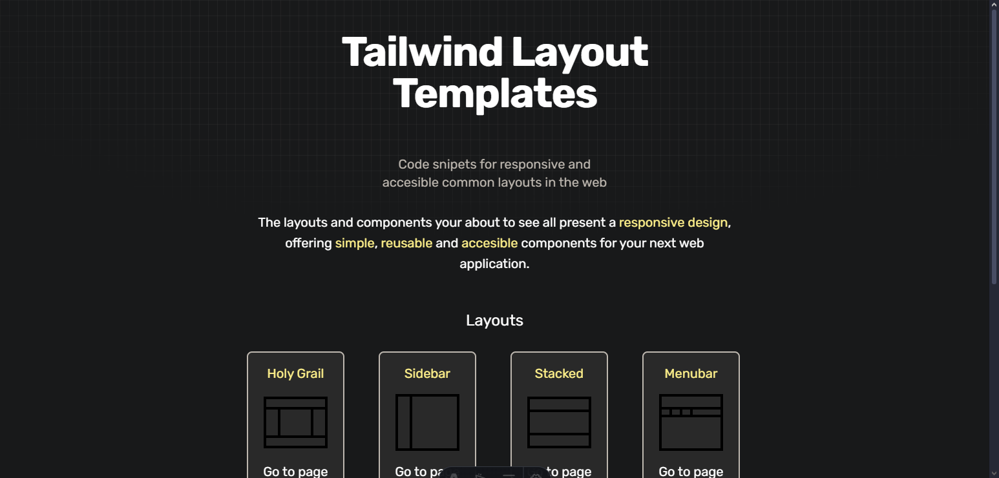
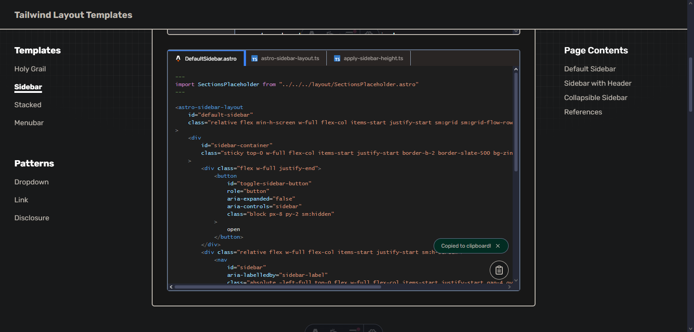

# Tailwind Layout Templates

Templates for common web layouts and patterns.

Code snippets for layouts and component templates made with TailwindCSS.

Visit the [website](https://tailwind-layout-templates.vercel.app) and look for the template that suits the best for your next project.

## About 📖

Tailwind Layout Templates is a compilation of common layouts (and patterns) in the web I made to deliver simple but powerfull ready-to-use templates using TailwindCSS and the bare-minimum JavaScript needed to tie everything together, taking references mainly from [The World Wide Web Consortium (W3C) Design System](https://www.w3.org/WAI/ARIA/apg/patterns/), the [ARIA Authoring Practices Guide (APG)
](https://www.w3.org/WAI/ARIA/apg/patterns/).

**Its porpouse** its to help you set up the layout for your next project soon as posible, considering accessibility and responsive design.

## Usage 🔍

Visit the [website](https://tailwind-layout-templates.vercel.app) and the click on any of the cards that interest you the most.

You will then navigate to the template's details page where you will see diferent implementations of the template and its references. For each implementation you will get to see a demo of how the layout would look like, beign able to **test the layout in different breakpoints** by clicking on the buttons on top of the demo, and **see the layout in a new tab** by clicking on the "see showcase" link on the far right.

Bellow the demo, you will see **all the necessary files to reproduce the exact layout showned on the demo** in a nice VSCode-like tab menu 😁. You can copy the content of the selected file by click the button fixed to the bottom-right corner.

